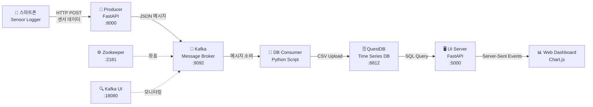
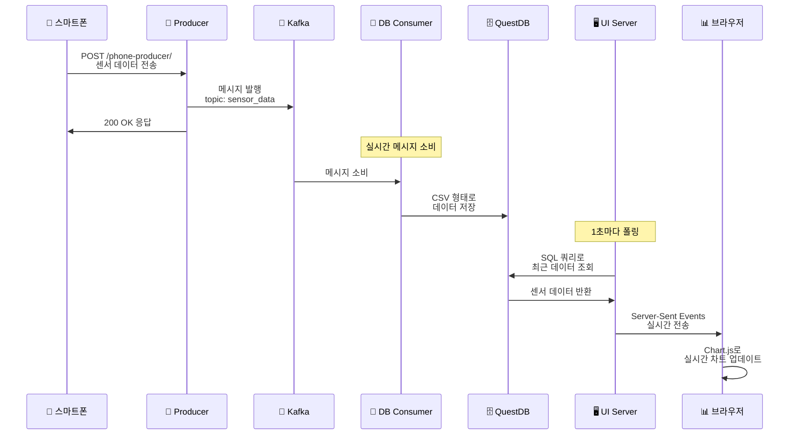

---

## 🔧 **전체 시스템 워크플로우 요약**

---

## 🕒 **실시간 데이터 플로우 (SequenceDiagram)**

---

## 📌 **시스템 구성 요약**

| 구성 요소                       | 설명                           | 포트       |
| --------------------------- | ---------------------------- | -------- |
| **📱 스마트폰**                 | 3축 센서 데이터 전송                 | -        |
| **🚀 Producer (FastAPI)**   | HTTP POST로 데이터 수신 후 Kafka 전송 | `:8000`  |
| **📨 Kafka**                | 메시지 브로커 (sensor\_data 토픽)    | `:9092`  |
| **⚙️ Zookeeper**            | Kafka 클러스터 좌표 저장             | `:2181`  |
| **🔍 Kafka UI**             | Kafka 메시지 모니터링               | `:18080` |
| **🔄 DB Consumer**          | Kafka 메시지를 수신 후 CSV 업로드      | -        |
| **🗄️ QuestDB**             | 시계열 DB (센서 데이터 저장)           | `:8812`  |
| **🖥️ UI Server (FastAPI)** | 실시간 데이터 쿼리 및 SSE 전송          | `:5000`  |
| **📊 Web Dashboard**        | Chart.js로 실시간 데이터 시각화        | -        |

---

## ⚙️ **Docker 명령어 정리**

| 작업             | 명령어                         |
| -------------- | --------------------------- |
| 시스템 전체 실행 및 빌드 | `docker-compose up --build` |
| 전체 종료          | `docker-compose down`       |
| 컨테이너 상태 확인     | `docker-compose ps`         |

---

## 🔄 **기존 3축 센서 → 다른 센서로 확장 시 고려사항**

* 📊 **데이터베이스 스키마 변경**: QuestDB 테이블 컬럼 추가/변경 필요
* 🎨 **UI 차트 로직 수정**: Chart.js 구성 변경
* 🔄 **Consumer 처리 로직 수정**: 메시지 파싱 및 CSV 포맷 변경
* 📡 **API 스키마 수정**: `/phone-producer`의 request body 구조 수정

---

